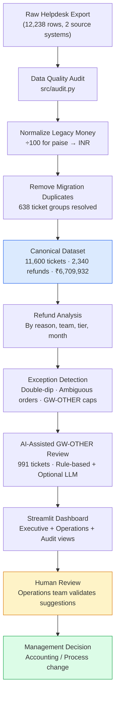
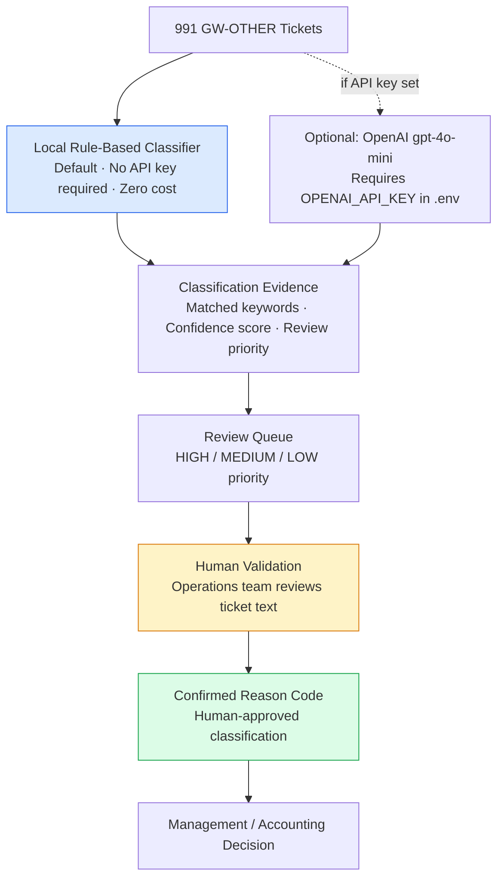

# Vireo Audio Refund Intelligence

> **For Finance & Operations reviewers:** This document is written in plain English. No Python, data-science, or engineering background is required to understand the business findings.  
> **For technical reviewers:** Jump to [Section 8](#8-technical-pipeline), [Section 9](#9-data-quality--validation), or [Section 13](#13-technical-pipeline-commands).

---

## 1. What This Project Does

Vireo Audio's Finance Controller, Arjun Mehta, observed that raw helpdesk support-ticket exports appeared to show refund spend exceeding **₹1 crore per quarter** — an implausibly large figure for an audio accessories business. Meanwhile, the Helpdesk Administrator reported operational refunds of roughly ₹11 lakh per quarter.

This project:

1. **Audits** the raw Freshdesk ticket export (12,238 rows across two source systems) to identify data-quality problems.
2. **Reconciles** the export into a trusted, deduplicated canonical dataset of 11,600 tickets and 2,340 verified refunds.
3. **Analyses** refund spend by reason code, team, tier, time period, and exception type.
4. **Detects exceptions** — tickets with both a refund and a replacement dispatch, tickets with ambiguous order links, and GW-OTHER refunds above the stated goodwill threshold.
5. **AI-assists** triage of the largest catch-all reason code (`GW-OTHER`) using a local rule-based NLP classifier, with an optional OpenAI adapter for live LLM support.
6. **Provides a dashboard** for Finance, Operations, and executive stakeholders.

> **Important — what this project does NOT do:**
> - It does **not** automatically change any financial ledger or accounting record.
> - It does **not** prove agent misconduct or fraud.
> - AI suggestions are advisory only. Every reclassification requires explicit human sign-off.

---

## 2. Executive Findings

All numbers below are verified from the canonical dataset (`data/processed/canonical_tickets.parquet`).

| Metric | Verified Value |
|---|---|
| **Canonical support tickets** | **11,600** |
| **Canonical refunds** | **2,340** (20.2% refund rate) |
| **Reconciled refund spend** | **₹67,09,932 (₹6,709,932)** |
| **Average refund per ticket** | **₹2,867.49** |
| **Quarterly average spend** | **~₹11.18 lakh/quarter** |
| **GW-OTHER refunds** | **991 tickets / ₹29,07,036** |
| **GW-OTHER above ₹500 threshold** | **879 review candidates** (not confirmed violations) |
| **Reclassification candidates** | **574 tickets / ₹15,76,028** (not cash savings) |
| **Refund + replacement indicators** | **166 total** (158 unambiguous, 8 ambiguous) |
| **Ambiguous order matches** | **707 tickets** |
| **Q3 2025 refund spend** | **₹12,07,091** |
| **Q4 2025 refund spend** | **₹16,27,575** (+34.8% vs Q3) |
| **Q3 CSAT** | **3.478** |
| **Q4 CSAT** | **3.507** (+0.029 observed; no causation established) |

> **₹15,76,028 is NOT cash savings.** It is a candidate cost-attribution correction — 574 GW-OTHER tickets where text evidence suggests a more specific policy reason code. Correcting reason codes reallocates spend to its true commercial driver. No accounting entry changes until a human reviewer confirms each reclassification.

> **879 GW-OTHER tickets above ₹500 are REVIEW CANDIDATES.** The ₹500 cap applies specifically to goodwill credits. Many of these tickets are likely legitimate returns or cancellations miscoded under GW-OTHER because it was the first dropdown option. They require human text and policy validation — not automatic reclassification.

> **166 refund + replacement indicators require VERIFICATION.** These are tickets where both a cash refund and a product replacement were recorded. 158 are unambiguously order-linked; 8 are ambiguous. Each requires cross-referencing against warehouse manifests and fulfilment records before drawing any operational conclusion.

---

## 3. Why the Finance Number Looked So High

The raw export appeared to show over ₹23 crore in total refunds (>₹1 crore per quarter). This was caused by **two independent data-quality artefacts**, not accounting errors or revenue leakage:

### Step-by-step reconciliation

```
Raw export total:  ₹23,01,24,081  (12,238 rows)
                        │
                        ▼
Problem 1: Legacy Freshdesk stored monetary amounts in native minor units (paise).
           Every legacy_fd amount needs ÷ 100 to convert to INR.
                        │
                        ▼
Problem 2: 638 tickets were re-imported during the platform migration cutover,
           appearing twice in the raw export (1,276 duplicate rows).
           Resolution: Keep the helpdesk record; discard the legacy_fd duplicate.
                        │
                        ▼
Reconciled total:  ₹67,09,932  (11,600 unique tickets / 2,340 refunds)
```

**Quarterly average after reconciliation: ~₹11.18 lakh/quarter** — matching the Helpdesk Administrator's operational figure exactly.

This is a **data-structure and migration finding**. Finance's underlying records are fully reconcilable.

---

## 4. Refund Reason Breakdown

All 2,340 refunds map to the eight Support Policy §5 reason codes:

| Reason Code | Description | Tickets | Spend (INR) | % of Spend |
|---|---|---|---|---|
| **GW-OTHER** | Goodwill / Other (catch-all) | 991 | ₹29,07,036 | 43.3% |
| **RETURN-QC-OK** | Return Passed Quality Check | 452 | ₹11,81,386 | 17.6% |
| **DUP-PAYMENT** | Duplicate Payment | 321 | ₹8,84,586 | 13.2% |
| **CANCEL** | Pre-Dispatch Cancellation | 222 | ₹6,12,950 | 9.1% |
| **DOA-REPL** | Dead-on-Arrival Replacement | 147 | ₹4,71,190 | 7.0% |
| **WTY-BUYBACK** | Warranty Buy-Back | 89 | ₹2,89,154 | 4.3% |
| **PRICE-ADJ** | Price Adjustment | 71 | ₹2,07,073 | 3.1% |
| **LOST-TRANSIT** | Lost in Transit | 47 | ₹1,56,557 | 2.3% |
| **Total** | | **2,340** | **₹67,09,932** | **100%** |

GW-OTHER absorbs 43.3% of total refund spend — the largest single category — primarily because it appeared first in the agent dropdown menu.

---

## 5. Business Workflow



> **Human review (yellow)** occurs before any management decision (green). The system never automatically modifies accounting records.

---

## 6. AI-Assisted GW-OTHER Review

### How it works



### Current status

| Item | Status |
|---|---|
| **Default classifier** | Local rule-based NLP baseline (`RuleBasedRefundClassifier`) |
| **Optional LLM** | OpenAI `gpt-4o-mini` via `LLMRefundClassifier` |
| **Live API calls made** | **0** |
| **API cost incurred** | **$0.00** |
| **Reason no live LLM run** | `OPENAI_API_KEY` unavailable during submission |
| **Current results source** | Rule-based baseline — all 991 GW-OTHER tickets |
| **574 candidates / ₹15,76,028** | Pending human confirmation before any accounting change |
| **Validation sample** | 100 tickets (stratified, `seed=42`) |
| **Human labels available** | 0 / 100 annotated |
| **Formal accuracy claimed** | **None** — no accuracy, precision, recall, or F1 published |
| **AI autonomy** | None — suggestions are strictly advisory |

The system does **not** automatically modify canonical financial records. The classifier writes only to a separate `predicted_reason_code` column; the original `refund_reason_code` is never overwritten.

---

## 7. Dashboard

Launch with `streamlit run app.py`. Seven navigation views are available:

| View | Who uses it | What it shows |
|---|---|---|
| **Executive Overview** | Finance Controller, Board | Reconciled spend KPIs, monthly trend chart, reason code pie chart, exception indicators |
| **Monthly & Cohort View** | Finance team | Filterable monthly breakdown by channel, team, and tier |
| **Reason Code Breakdown** | Operations Manager | Full 8-code financial table and monthly spend trajectory per code |
| **Agent & Operations View** | Operations Manager | Tier-separated agent tables; Returns Desk and Billing Escalations shown separately. No misconduct ranking. |
| **AI-Assisted Review (GW-OTHER)** | Audit team | 991 GW-OTHER tickets with predicted code, confidence, priority, evidence text. Advisory notice prominent. |
| **Exception & Audit Queue** | Audit / Finance | Double-dip indicators, ambiguous order matches, high-value refunds (≥₹5,000), GW-OTHER cap candidates |
| **Business Value Framework** | CFO / Operations | Reclassification opportunity vs. actual cash recovery; validation status; AI governance |

---

## 8. Technical Pipeline

```mermaid
flowchart LR
    A["data/raw/\n(immutable source files)"]
    B["src/audit.py\nSchema · Duplicates · Monetary"]
    C["src/normalize.py\nPaise→INR · Dedup · Order match"]
    D["data/processed/\ncanonical_tickets.parquet\ncanonical_refunds.csv"]
    E["src/analyze.py\nMonthly · Reason · Agent · Exceptions"]
    F["src/classify.py\nGW-OTHER 991 tickets · Rule-based"]
    G["src/evaluate_classifier.py\nValidation sample · Metrics if labeled"]
    H["reports/\nMarkdown · CSV · JSON"]
    I["app.py\nStreamlit Dashboard"]

    A --> B --> C --> D --> E --> F --> G --> H
    D --> I
    H --> I
```



---

## 9. Data Quality & Validation

| Metric | Value |
|---|---|
| Raw ticket rows | 12,238 |
| Canonical unique tickets | **11,600** |
| Migration duplicate groups identified | **638** (1,276 rows removed) |
| Canonical refunds | **2,340** |
| Reconciliation exceptions after normalization | **0** |
| Automated tests passed | **72 / 72** |
| Clean-machine verification | **PASS** (fresh venv, `requirements.txt` only) |
| Raw source files altered | **Never** |
| Ambiguous order matches resolved by guessing | **Never** (707 flagged, retained ambiguous) |

**Test coverage by module:**

| Module | Tests |
|---|---|
| `tests/test_audit.py` | 17 — schema, duplicate detection, monetary parsing, referential integrity |
| `tests/test_normalize.py` | 18 — paise→INR conversion, migration dedup, order matching, golden benchmarks |
| `tests/test_analyze.py` | 13 — monthly reconciliation, reason/agent breakdowns, double-dip isolation, tier separation |
| `tests/test_classify.py` | 19 — 8-code label space, confidence clamping, mock LLM parsing, error fallbacks, secret safety, metadata immutability |
| `tests/test_evaluate_classifier.py` | 5 — unvalidated sample reporting, confusion matrix, synthetic F1 on annotated examples |

---

## 10. Business Controls & Recommendations

The following are the documented recommendations from the refund audit. Controls marked **(proposed)** are new operational controls suggested by this analysis — they are not current policy.

1. **Restructure the GW-OTHER dropdown.** Remove from the top position; require a mandatory reason subcategory. This reduces catch-all overuse without changing existing policy.
2. **Enforce goodwill credit thresholds.** Require Team Lead counter-sign for credits above the stated ₹500 policy cap. *(Proposed management control: hard system block above ₹1,000.)*
3. **Close refund + replacement double-dip gaps.** *(Proposed management control: hard-stop preventing concurrent refund and replacement execution on the same order ID.)*
4. **Monthly Finance reconciliation cadence.** Match helpdesk refund records against payment gateway settlements monthly rather than quarterly.
5. **Review 574 reclassification candidates.** Operations team leads review flagged GW-OTHER tickets. No accounting entry changes until human sign-off.
6. **Verify 166 refund + replacement indicators** against warehouse return receipts and carrier manifests within 30 days.
7. **Use AI classification as decision-support only.** All financial ledger changes require explicit human confirmation.

---

## 11. Project Structure

```text
vireo-audio-refund-intelligence/
│
├── data/
│   ├── raw/                         # Raw immutable source files (never modified)
│   ├── processed/                   # Canonical datasets (generated by pipeline)
│   │   ├── canonical_tickets.parquet
│   │   └── canonical_refunds.csv
│   └── validation/
│       └── gw_other_validation_sample.csv   # 100-ticket human review sample
│
├── src/
│   ├── config.py                    # Policy constants & path resolution
│   ├── loader.py                    # Schema validation & immutable data loaders
│   ├── audit.py                     # Data audit engine & CLI
│   ├── normalize.py                 # Paise→INR conversion & deduplication
│   ├── analyze.py                   # Business analysis & exception detection
│   ├── classify.py                  # AI-assisted GW-OTHER classification
│   └── evaluate_classifier.py       # Validation metrics against human labels
│
├── tests/                           # 72 automated tests (pytest)
│
├── reports/
│   ├── executive-memo.md            # One-page Finance Controller memo
│   ├── demo-script.md               # ≤3-minute screen recording script
│   ├── final-clean-machine-qa.md    # Clean-machine reproducibility report
│   ├── client-number-reconciliation.md  # Canonical number verification
│   ├── analysis-summary.md          # Full business analytics report
│   ├── ai-validation.md             # AI validation status & workflow
│   ├── ai_usage.md                  # API calls: 0, cost: $0
│   ├── classification_results.csv   # 991 GW-OTHER tickets classified
│   └── classification_review_queue.csv  # Prioritised audit queue
│
├── docs/
│   └── source-context.md            # Policy synthesis & reconciliation rules
│
├── app.py                           # Streamlit dashboard (7 views)
├── requirements.txt                 # Pinned dependencies
├── pytest.ini                       # Test configuration
├── .env.example                     # Environment variable template (placeholders only)
├── submission-form.md               # Assignment submission form
└── README.md                        # This document
```

---

## 12. Quick Start — Non-Technical (Windows)

You need Python 3.11+ installed. No cloud accounts or paid services are required.

```powershell
# 1. Open a terminal (PowerShell or Command Prompt) in the project folder

# 2. Create a fresh virtual environment
python -m venv .venv

# 3. Activate the environment (Windows)
.venv\Scripts\activate
# On Linux / macOS: source .venv/bin/activate

# 4. Install all dependencies
pip install -r requirements.txt

# 5. Run the data pipeline (only needed if processed files are missing)
python -m src.audit
python -m src.normalize
python -m src.analyze
python -m src.classify
python -m src.evaluate_classifier

# 6. Start the dashboard
streamlit run app.py
```

Open the URL shown in the terminal (usually `http://localhost:8501`).

No external API keys are required to run the dashboard with the rule-based classifier.

---

## 13. Technical Pipeline Commands

All commands verified on Python 3.11.9, Windows, clean virtual environment:

```bash
# Data audit — validates schema, detects duplicates, reports monetary anomalies
python -m src.audit

# Normalization — paise→INR conversion, deduplication, order matching
python -m src.normalize

# Business analysis — reason codes, agents, exceptions, quarterly trends, CSAT
python -m src.analyze

# AI-assisted classification — 991 GW-OTHER tickets, rule-based baseline
python -m src.classify

# Classifier evaluation — validation metrics (pending human labels)
python -m src.evaluate_classifier

# Automated test suite — 72 tests
pytest -v

# Streamlit dashboard
streamlit run app.py
```

---

## 14. Reports & Submission Artifacts

| Document | Location | Purpose |
|---|---|---|
| Executive Memo | [`reports/executive-memo.md`](reports/executive-memo.md) | One-page Finance Controller summary |
| Demo Script | [`reports/demo-script.md`](reports/demo-script.md) | ≤3-minute screen recording guide |
| Clean-Machine QA | [`reports/final-clean-machine-qa.md`](reports/final-clean-machine-qa.md) | Reproducibility verification report |
| Number Reconciliation | [`reports/client-number-reconciliation.md`](reports/client-number-reconciliation.md) | Canonical vs. document number check |
| AI Validation | [`reports/ai-validation.md`](reports/ai-validation.md) | Validation status & annotation workflow |
| AI Usage | [`reports/ai_usage.md`](reports/ai_usage.md) | API calls: 0 / Cost: $0 |
| Classification Results | [`reports/classification_results.csv`](reports/classification_results.csv) | 991 GW-OTHER tickets with predictions |
| Review Queue | [`reports/classification_review_queue.csv`](reports/classification_review_queue.csv) | Prioritised audit queue |
| Submission Form | [`submission-form.md`](submission-form.md) | Complete assignment submission |

---

## 15. AI Disclosure

| Field | Value |
|---|---|
| **AI/ML component** | `src/classify.py` — rule-based NLP baseline + optional OpenAI adapter |
| **Default classifier** | `RuleBasedRefundClassifier` (local, deterministic, zero cost) |
| **Optional LLM model** | `gpt-4o-mini` (configured via `OPENAI_MODEL` environment variable) |
| **Live API calls made** | **0** |
| **API cost incurred** | **$0.00** |
| **Reason no live LLM run** | `OPENAI_API_KEY` unavailable in the development environment |
| **All current results from** | Rule-based baseline only |
| **Fabricated model metrics** | None |
| **AI autonomy** | None — all suggestions are advisory; human confirmation required for any financial change |
| **Validation labels available** | 0 / 100 — formal accuracy not yet established |
| **Discarded approach** | Unconstrained LLM generation without schema enforcement — rejected to prevent non-policy label fabrication |
| **Discarded approach** | Automatic database updates to reason codes — rejected to preserve audit trail integrity |

---

## 16. Known Limitations

1. **No human-labeled validation set.** Classifier accuracy, precision, recall, and F1 are not formally established. The 100-ticket validation sample is ready for annotation by the operations team.
2. **AI classification not accuracy-certified.** All 574 reclassification candidates are NLP rule-based suggestions. Each requires independent human review.
3. **GW-OTHER candidates are not verified.** The keyword/rule matching identifies likely mismatch patterns; it does not prove a refund was improper.
4. **Ambiguous order matches remain ambiguous.** 707 tickets cannot be deterministically linked to a single order. Guessing is not performed.
5. **Refund + replacement indicators require fulfilment verification.** 166 tickets show both signals; confirmation requires warehouse and carrier record cross-referencing.
6. **Q4 spend increase unexplained.** The +34.8% Q3→Q4 rise is factual; the underlying cause is not established from the current data.
7. **This analysis identifies patterns and candidates. It does not establish causality, agent misconduct, or confirmed policy violations.**