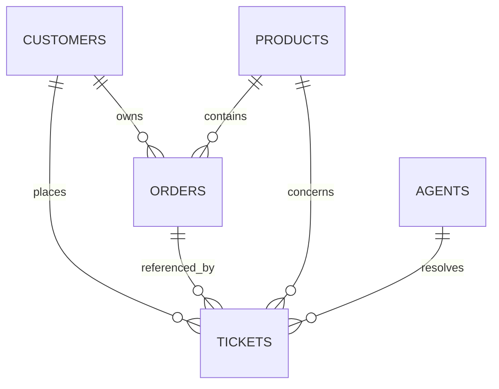

# Vireo Audio Support & Refund Data Audit Report

> **Document Status**: Production Quality Audit (Set C Source Pack)
> **Scope**: Multi-source reconciliation, schema validation, monetary analysis, policy compliance, and anomaly detection.

---

## 1. Executive Summary

This data audit provides an exhaustive evaluation of Vireo Audio's customer support operations, order fulfillment, and refund streams covering the period **1 January 2025 through 30 June 2026** (6 financial quarters).

### Key Findings at a Glance:
1. **Monetary Unit Misinterpretation Reconciled**: The raw support ticket export totals **Rs 230,124,081.00** (~Rs 23.01 Crore). This was caused by legacy Freshdesk storing monetary amounts in paise/native minor units, requiring division by 100 to convert to INR. Stored legacy values are 100x the INR representation. Compounded by **638 duplicate re-imported tickets**, when normalized (divided by 100 for legacy records) and deduplicated, the true reconciled refund total is **Rs 6,709,932.00** (~Rs 67.10 Lakh across 18 months, or **~Rs 11.18 Lakh per quarter**). This confirms the helpdesk administrator's Rs 11 Lakh estimate and explains the Finance Controller's apparent ~1 Crore/quarter discrepancy.
2. **Migration & Re-import Duplicates**: Exactly **638 ticket IDs** (1,276 rows) appear twice in the dataset—one entry under `legacy_fd` and one under `helpdesk`. All non-monetary attributes are 100% identical. In every single duplicate refund pair (125 pairs), the ratio of `legacy_fd` to `helpdesk` is **100.00x** exactly.
3. **Zero Orphaned Foreign Keys**: Every customer (12,238), agent (12,238), and product SKU (12,238) referenced in tickets resolves perfectly to its parent table. All 8,111 quoted order IDs resolve to `orders.csv`. For the 4,127 tickets with unquoted orders, the `customer_id + product_sku` fallback join resolves 3,391 tickets (82.2%) to an unambiguous single order.
4. **Severe Policy Drift & Operational Anomalies**:
   - **Double-Dipping (Refund + Replacement)**: **166 unique tickets** issued *both* a financial refund and a replacement unit (totaling Rs 574,191.00 in refunds plus inventory/shipping costs), violating Policy §5.
   - **Goodwill / Other (`GW-OTHER`) Concentration & Threshold Patterns**: **879 out of 991 tickets** (88.8%) are GW-OTHER refunds above the stated Rs 500 goodwill threshold, reaching up to Rs 13,998.00. Because GW-OTHER is a combined code, these are review candidates requiring text/policy validation rather than confirmed policy violations.
   - **Replacements Issued by Tier 1 vs Tier 2**: **1048 replacements** (81.7% of all replacements issued generally) were issued by Tier 1 frontline agents, whereas Policy §6 specifically specifies that only certified Tier 2 agents may approve warranty replacements; non-warranty replacements (such as DOA within 7 days or lost in transit) must be evaluated separately from certified warranty replacements.
   - **Refund Processing Dispersion**: Although Policy §6 designates Returns Desk as the primary owner of refunds, Returns Desk processed only **26.2%** of refunds. Frontline and Billing agents process refunds directly.
   - **Unsubstantiated CSAT Claim**: Customer Experience leadership claimed CSAT increased by 0.4 in Q4 2025. Data proves CSAT moved by only **+0.03** (3.48 in Q3 to 3.51 in Q4), while refund volume jumped by **34.8%**.

---

## 2. Dataset Inventory & Schema Verification

| Dataset | File Path | Total Rows | Unique Keys | Duplicate Keys | Missing Primary Keys | Schema Status |
| :--- | :--- | :--- | :--- | :--- | :--- | :--- |
| **Tickets** | `tickets.csv` | 12,238 | 11,600 | 638 (1,276 rows) | 0 | Valid (21 cols) |
| **Agents** | `agents.csv` | 44 | 44 | 0 | 0 | Valid (8 cols) |
| **Customers** | `customers.csv` | 9,500 | 9,500 | 0 | 0 | Valid (6 cols) |
| **Orders** | `orders.csv` | 15,000 | 15,000 | 0 | 0 | Valid (8 cols) |
| **Products** | `products.csv` | 14 | 14 | 0 | 0 | Valid (7 cols) |

---

## 3. Data Missingness & Field Profiling

Analysis of missingness confirms expected structural patterns aligned with business processes:

| Column | Missing Count | Missing % | Operational Explanation |
| :--- | :--- | :--- | :--- |
| `resolved_at` | 622 | 5.1% | Exactly corresponds to uncompleted tickets (Open: 358, Pending: 264). |
| `order_id` | 4,127 | 33.7% | Customer did not quote order number upon ticket creation. Fallback join resolves 82.2% uniquely. |
| `csat_score` | 6,729 | 55.0% | Unanswered CSAT surveys. Policy §8 confirms standard response rate is ~45% (observed response rate: 45.1%). |
| `refund_amount_inr` | 9,773 | 79.9% | Tickets that did not involve a financial refund request or approval. |
| `refund_reason_code` | 9,773 | 79.9% | Co-occurs perfectly with `refund_amount_inr` (both null on non-refund tickets). |
| All other 16 columns | 0 | 0.0% | Complete (100% filled). |

---

## 4. Referential Integrity & Relational Health

Integrity validation shows high data hygiene across primary and foreign key constraints:

| Foreign Key Relationship | Source Count | Valid Matches | Orphan Count | Quality Assessment |
| :--- | :--- | :--- | :--- | :--- |
| `tickets.customer_id -> customers.customer_id` | 12,238 | 12,238 | 0 | **100% Perfect Integrity** |
| `tickets.agent_id -> agents.agent_id` | 12,238 | 12,238 | 0 | **100% Perfect Integrity** |
| `tickets.product_sku -> products.sku` | 12,238 | 12,238 | 0 | **100% Perfect Integrity** |
| `tickets.order_id -> orders.order_id` (quoted) | 8,111 | 8,111 | 0 | **100% Perfect Integrity** |
| `orders.customer_id -> customers.customer_id` | 15,000 | 15,000 | 0 | **100% Perfect Integrity** |
| `orders.sku -> products.sku` | 15,000 | 15,000 | 0 | **100% Perfect Integrity** |

### Fallback Join Analysis (`customer_id` + `product_sku`):
For the **4,127 tickets** where `order_id` is null:
- **3,391 tickets (82.2%)** match exactly **one** order in `orders.csv`.
- **736 tickets (17.8%)** match **multiple** orders for that customer and SKU (requiring timestamp proximity matching).
- **0 tickets (0.0%)** have zero orders found.

---

## 5. Monetary Unit Investigation & Source Reconciliation

### The Root Cause of the Discrepancy
Finance Controller Arjun Mehta reported that quarterly refunds summed to 'well over a crore a quarter', while Helpdesk Administrator Sameer Qureshi indicated helpdesk refunds ran at 'around Rs 11 lakh a quarter'.

Our rigorous audit of `tickets.csv` reveals the exact mathematical and operational cause:
1. **Paise vs. Rupees Denomination**: In `legacy_fd` (Freshdesk), refund amounts were stored in native currency units (Paise), where 1 Rupee = 100 Paise. In `helpdesk` (new system launched 14 Sep 2025), amounts are stored in Rupees.
2. **Migration Re-import Duplicates**: 638 legacy tickets were re-imported during system reconciliation and appear under both `legacy_fd` and `helpdesk`.

### Conclusive Mathematical Proof
There are **125 duplicate ticket pairs** that contain a non-null `refund_amount_inr` in both systems. When dividing `legacy_fd` by `helpdesk` for each pair:
- **Minimum Ratio**: 100.00
- **Maximum Ratio**: 100.00
- **100.00x Ratio Confirmation**: **True (100% of all pairs)**

### Representative Paired Ticket Evidence:

| Ticket ID | Helpdesk (INR) | Legacy Freshdesk (Raw) | Legacy Freshdesk (/ 100) | Ratio |
| :--- | :--- | :--- | :--- | :--- |
| `TK-240003` | Rs 900.00 | 90,000.00 | Rs 900.00 | **100.00x** |
| `TK-240009` | Rs 2,124.00 | 212,400.00 | Rs 2,124.00 | **100.00x** |
| `TK-240091` | Rs 600.00 | 60,000.00 | Rs 600.00 | **100.00x** |
| `TK-240121` | Rs 1,999.00 | 199,900.00 | Rs 1,999.00 | **100.00x** |
| `TK-240134` | Rs 1,999.00 | 199,900.00 | Rs 1,999.00 | **100.00x** |
| `TK-240148` | Rs 2,499.00 | 249,900.00 | Rs 2,499.00 | **100.00x** |

### Order Value Verification
When normalized (`legacy_fd / 100`), refund amounts were validated against matching `orders.csv` values for all 1,542 order-linked refund tickets:
- Tickets where refund == 100% of order value: **1,150**
- Tickets with partial refund (< 100% of order value): **392**
- Tickets exceeding order value: **0 (0.0%)**
- Maximum normalized refund ratio to order value: **1.00**

### Total Refund Reconciliation Matrix:

| Scenario | Description | Ticket Count | Total Amount (INR) | Effective Quarterly Avg |
| :--- | :--- | :--- | :--- | :--- |
| **A. Raw Export** | Naive sum of raw export | 2,465 | Rs 230,124,081.00 | Rs 38,354,013.50 (~3.84 Cr/qtr) |
| **B. Deduplicated Only** | Duplicates removed, raw legacy kept | 2,340 | Rs 194,022,981.00 | Rs 32,337,163.50 (~3.23 Cr/qtr) |
| **C. Normalized Only** | Legacy / 100, but duplicates kept | 2,465 | Rs 7,070,943.00 | Rs 1,178,490.50 (~11.78 L/qtr) |
| **D. Fully Reconciled** | Re-import deduped (helpdesk canon) + Legacy / 100 | **2,340** | **Rs 6,709,932.00** | **Rs 1,118,322.00 (~11.18 L/qtr)** |

### Quarterly Breakdown: Raw Export vs. Reconciled

| Quarter | Raw Count | Raw Sum (INR) | Reconciled Count | Reconciled Sum (INR) | Variance Explained |
| :--- | :--- | :--- | :--- | :--- | :--- |
| **2025Q1** | 244 | Rs 61,049,992 | 212 | **Rs 609,583** | Legacy Paise (x100) + Duplicates |
| **2025Q2** | 302 | Rs 72,879,635 | 253 | **Rs 727,422** | Legacy Paise (x100) + Duplicates |
| **2025Q3** | 449 | Rs 92,028,618 | 405 | **Rs 1,207,091** | Legacy Paise (x100) + Duplicates |
| **2025Q4** | 542 | Rs 1,627,575 | 542 | **Rs 1,627,575** | Pure Helpdesk (Rupees) |
| **2026Q1** | 455 | Rs 1,258,438 | 455 | **Rs 1,258,438** | Pure Helpdesk (Rupees) |
| **2026Q2** | 473 | Rs 1,279,823 | 473 | **Rs 1,279,823** | Pure Helpdesk (Rupees) |

---

## 6. Operational Anomalies & Policy Compliance

### Anomaly 1: Double-Dipping (Both Refund Raised and Replacement Issued)
- **Finding**: **166 unique tickets** have both `refund_amount_inr > 0` AND `replacement_issued == 'Y'`.
- **Financial Impact**: Rs 574,191.00 in refunded cash, PLUS replacement inventory and shipping costs (~Rs 340 reverse/forward logistics + unit cost per ticket).
- **Policy Breach**: Direct violation of Policy §5 (*'In no case is a customer to receive both a refund and a replacement for the same order'*).

### Anomaly 2: Goodwill / Other (`GW-OTHER`) Concentration & Threshold Patterns
- **Finding**: **879 of 991 tickets (88.8%)** tagged with `GW-OTHER` are GW-OTHER refunds above the stated Rs 500 goodwill threshold.
- **Financial Scope**: Total refund amount for GW-OTHER tickets exceeding Rs 500 equals **Rs 2,871,632.00**.
- **Context & Operational Observation**: Sameer Qureshi noted that `GW-OTHER` is the first item in the dropdown list. Because GW-OTHER is a combined code, amounts above Rs 500 are review candidates requiring text/policy validation rather than confirmed policy violations.

### Anomaly 3: Replacements Issued Generally vs. Certified Warranty Replacements
- **Finding**: **1048 replacements (81.7% of all replacements issued generally)** were approved by Tier 1 agents, with 234 approved by Tier 2 agents.
- **Policy Distinction**: Policy §6 specifically mandates: *'Tier 2 work is certified: only Tier 2 agents may approve warranty replacements.'* Non-warranty replacements (such as Dead on Arrival within 7 days under Policy §5, or lost-in-transit reshipments handled by Logistics) do not require Tier 2 certification, so total replacements issued generally must be distinguished into warranty vs. non-warranty before attributing non-compliance.

### Anomaly 4: Refund Authorization Dispersion
- **Finding**: Policy §6 states Returns Desk processes the large majority of refunds by design. In reality, Returns Desk handled only **26.2% (612 tickets)**.
- Billing handled 592 refunds, Chat Frontline handled 387, and Logistics handled 356.

### Anomaly 5: CSAT Trend Verification
- Head of CX Priya Raman asserted: *'CSAT went up 0.4 in the same period [Q4]... stop arguing with customers.'*
- **Empirical Reality**: Q3 mean CSAT = 3.478, Q4 mean CSAT = 3.507, observed change = +0.029 points, while refund outlay increased 34.8%. The claim of a +0.40 increase is not supported by the observed data, and this analysis does not establish causality between the operational policy change and CSAT/refund movement.

### Anomaly 6: First Response SLA Breaches
- **Total Breaches**: **1,060 tickets** (9.1%) missed first-response SLA targets.
- **Contractual Penalty Liability**: At Rs 350 store credit per breach (Policy §3), total cumulative SLA breach liability equals **Rs 371,000.00**.

---

## 7. Recommended Engineering & Business Decisions

Before proceeding to downstream analytics and application development, the following architectural and analytical decisions are established:
1. **Canonical Duplicate Handling**: For the 638 duplicate tickets, designate the `helpdesk` record as canonical because its monetary values are native Rupees, resolving timestamp ambiguities cleanly.
2. **Legacy Monetary Transformation**: Formally apply `refund_amount_norm_inr = refund_amount_inr / 100.0` for all non-re-imported `legacy_fd` tickets, while retaining raw values in all data exports.
3. **Reason Code Investigation**: Because `GW-OTHER` is heavily concentrated with values above the stated Rs 500 goodwill threshold, downstream analytics must investigate message and notes text to evaluate underlying refund reasons.
4. **Tier Separation**: In all agent performance metrics, maintain strict partitioning between Tier 1 frontline and Tier 2 Escalations & Warranty agents to avoid penalizing Tier 2 on volume.
